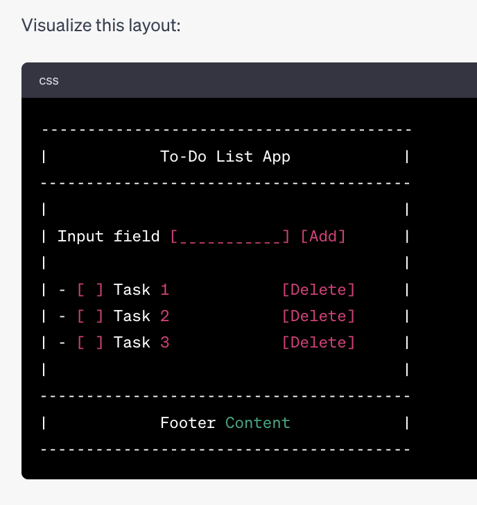

# Simple To-Do List Website

Welcome to the Simple To-Do List Website project. This website allows users to quickly add tasks to a list. It's built using basic HTML, CSS, and JavaScript, making it a great starting point for beginners in web development.

  <!-- Assuming you have a screenshot.png in the root -->

## Features

- Add tasks to the list.
- Clear input after adding a task.
- Basic, responsive design.

## Getting Started

### Prerequisites

- A modern web browser (Chrome, Firefox, Safari, Edge).

### Usage

1. Clone or download this repository.
2. Open the `index.html` file in your web browser.
3. Start adding tasks to your to-do list!

## Customizing

You can customize the website by:

- Modifying `styles.css` for design changes.
- Enhancing the functionality by updating `script.js`.
- Changing content or structure in `index.html`.

## Contributing

Feel free to fork this project and make your own changes. Pull requests are welcome!

## Feedback

For any feedback, issues, or feature requests, please [create an issue](https://github.com/YOUR_GITHUB_USERNAME/simple-todo-website/issues) on the GitHub repository.

## License

This project is open-source and available under the MIT License.

## Acknowledgments

- Thanks to everyone who attended the workshop and provided feedback!

